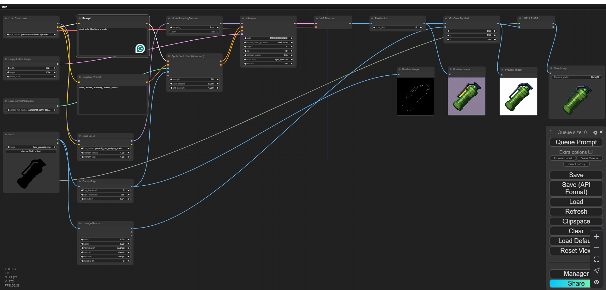

# Image Generation
We'll be using ComfyUI for Image Generation. 

ComfyUI is a web-based Stable Diffusion interface optimized for workflow customization. It’s a modular framework designed to enhance the user experience and productivity when working with Stable Diffusion, a powerful AI text-to-image generation model.

The platform offers a graph/nodes interface that simplifies the process of creating and modifying image generation tasks.

You can easily connect nodes representing different aspects of the image generation process, such as text prompts, image inputs, and various AI-powered filters and augmentations.

And most importantly - it's FREE!

