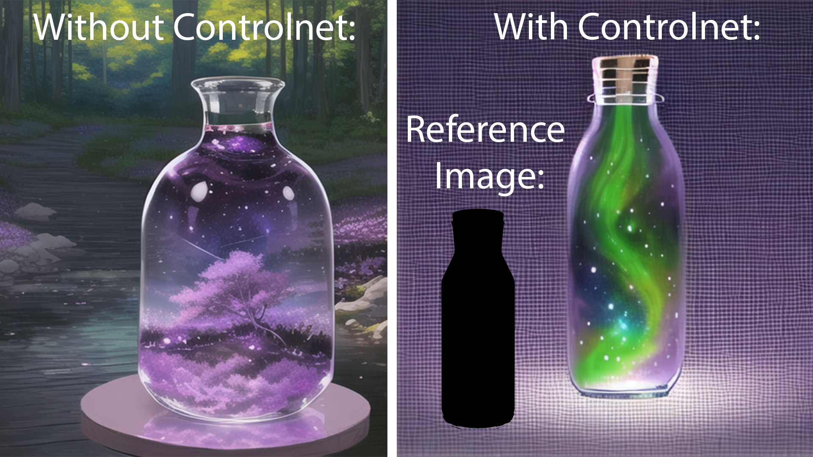
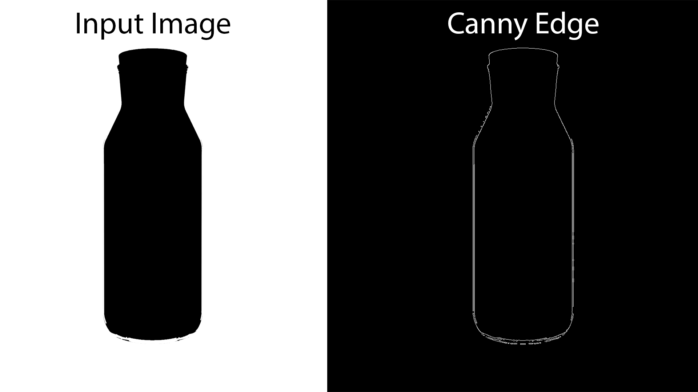
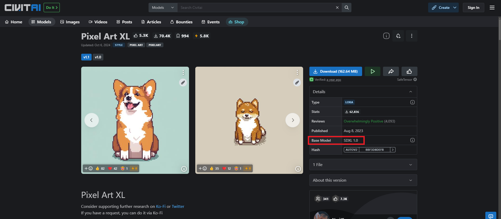

# Control Net
1. Control Net is a very useful feature. Where you can upload your own `reference image`, along with your `prompt` to control your image output. This process is also called `image 2 image`. Some control nets include:
    1. `Canny Edge`
    1. `Human Pose`
    1. `Depth`

## Canny Edge
Canny edge is one of the many edge detection methods. Passing the image through Canny Edge will trace out the edges of the image in white while coloring the rest in black. This tells the KSampler to draw the image within the bounds of the edge.
| Pros  | Cons                                                                                               |
| ----- | ---------------------------------------------------------------------------------------------------|
| Can accurately determine the size & shape of the image | Color in the reference image is not accounted for |
| Fast processing time | Large file size of >1GB |

## Human Pose
Human Pose is a control net type that extracts human poses like positions of hands, legs, and head. They are then saved as a control map containing the positions of key points. It is then fed to Stable Diffusion as an extra conditioning together with the text prompt.

| Pros  | Cons                                                                                               |
| ----- | ---------------------------------------------------------------------------------------------------|
| Can accurately determine the pose of the character | Similar to Canny Edge, the only detail accounted for is the pose |
| | Works best with humans, not very good for other body types |

## Depth
The depth preprocessor guesses the depth information from the reference image. It will then store the data as a depth map an pass it to the KSampler for diffusion. This can result in images with much more depth & clear layers (background, middleground, foreground, etc).

| Pros  | Cons                                                                                               |
| ----- | ---------------------------------------------------------------------------------------------------|
| Gives image more depth, making it look semi-realistic 3D | The depth preprocessor only guesses the depth information, so it can be quite inaccurate at times|

 

## More Info
For more information about control nets, refer to this [article](https://stable-diffusion-art.com/controlnet/).

## Application In ComfyUI
1. To get started, let's go with the Canny Edge detection control net first. Control Nets are VERSION SPECIFIC, so make sure you download a `controlnet` that fits the version of your `checkpoint model`. If you're using [CivitAI](https://civitai.com/models) to download a `checkpoint model`, you can check its `base model version` at the side. Make sure the `controlnet model version` matches this as well!

1. Since we're using `SD1.0 Turbo` as our `checkpoint model`, it is of version `SD1.0`. Therefore, you should download [this](https://huggingface.co/diffusers/controlnet-canny-sdxl-1.0/resolve/main/diffusion_pytorch_model.fp16.safetensors?download=true) `canny checkpoint model` and place it under `ComfyUI>models>controlnet`.

1. Back in ComfyUI, we'll need 3 additional nodes:
    1. `Load ControlNet Model`
    1. `Load Image`
    1. `Apply ControlNet`

1. To quickly find and create a new node, double click on an empty area in your `workflow`. Search for `Load ControlNet Model` and click on the node to add it into the workflow. Do the same for `Load Image` and `Apply ControlNet` and position them like so:

    

1. Download and upload [this](../images/item_bottle.png) reference image in the `Load Image` node and connect the `IMAGE` endpoint on `Load Image` to the `image`input on `Apply ControlNet`. Make sure to assign your `control net model` in `Load ControlNet` as well.

    

1. Apply the `CONTROL_NET` endpoint in `Load Controlnet` to the `control_net` input in `Apply ControlNet`. 
1. Redirect the `positive` & `negative` prompts to `Apply ControlNet`, and assign the `positve` & `negative` ouputs to `KSampler`.

    

1. After doing all the steps mentioned above, press the `Queue Prompt` button and the result should take the shape of the reference image you placed in.