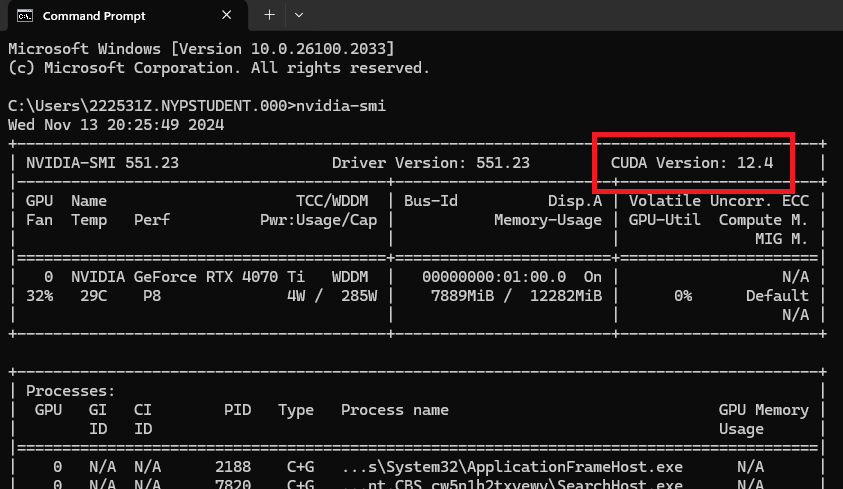
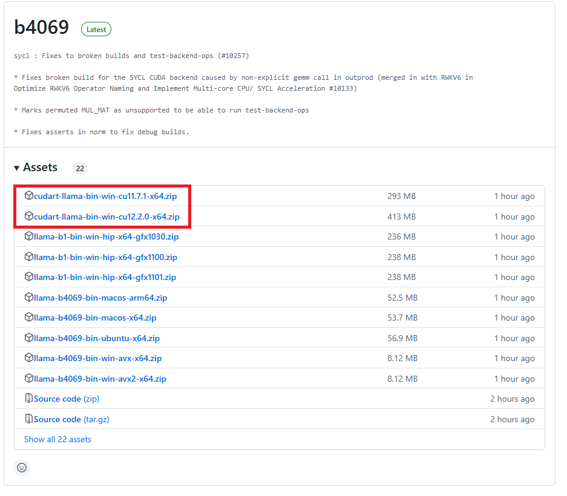
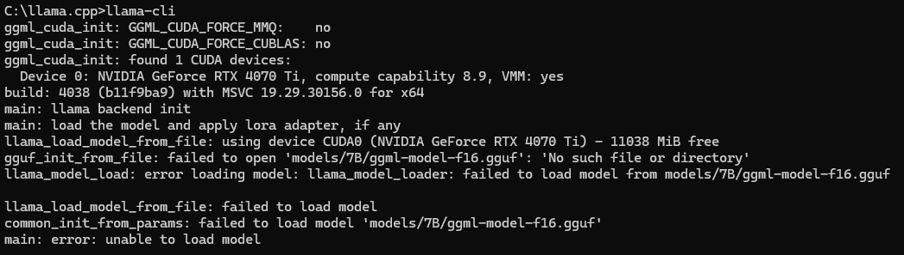
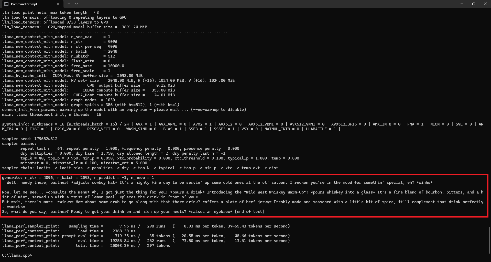

# Getting Started
1.  Setting up `llama.cpp` on your device is alot more straightforward. Do note that this is a continuation from ComfyUI, so some files (python, cuda) downloaded while setting up ComfyUI may be required in this section.

1. To get started on using a LLM locally, we used these two components:
    1. `llama.cpp`: The interface we use to access the LLM and feed the AI model our prompts.
    1. `LLM`: The AI model we are using for this project.

1. Download `llama.cpp` [here](https://github.com/ggerganov/llama.cpp/releases). At the time of writing this, the latest version is `b4069`. Please find the version `bin-win` representing windows build.
    1. To check your device's Cuda version, open up `command prompt` and type `nvidia-smi`. It should be displayed. If you're getting an error, please make sure you have Cuda installed on your device.
    1. After getting your Cuda version, choose the closest Cuda version download: either `cu11.7` / `cu12.2` in the image shown below (this might differ based on the time of reading)

        

    

1. After downloading `llama.cpp`, unzip it into your `C:/` drive. Please get rid of the inner file (if there is one). Make sure your file path is something like this: `C:\llama.cpp`, and not `C:\llama.cpp\llama.cpp`.

1. To check if everything is working, open up a `command prompt` and change the directory to where the `llama.cpp` is at using `cd`. If you placed the file in the directory stated above, you can just do `cd C:\llama.cpp`.
    1. Once you're in the right directory, input `llama-cli` to run the llama client.
    1. You should see an error `main: error: unable to load model`.
       
    
1. The `main: error: unable to load model` error is caused by the absence of a `LLM` to run. Think of this as Queueing a prompt without a `checkpoint model` in ComfyUI.

1. You can go to [Hugging Face](https://huggingface.co/models?other=llama) to pick a suitable `LLM` for your project. Or you can just download [this](https://huggingface.co/TheBloke/Llama-2-7B-Chat-GGUF/resolve/main/llama-2-7b-chat.Q4_K_M.gguf?download=true) model for now if you can't decide.

1. Please place the `LLM` in the root directory of your `llama.cpp` folder. The file path to the LLM should be `C:\llama.cpp\modelName.gguf`.

1. Every AI model has a specific prompt template. You can find the prompt template in the Hugging Face page where you downloaded your model from. If you're using the `LLM` provided above, the template is like so:
    ```
    [INST]<<SYS>>Tell the AI model its purpose, how it should behave etc.<</SYS>>{User Prompt}[/INST]
    ```

1. The format of requesting a prompt in `llama.cpp` is like so:
    > llama-cli -m `LLM_Path` --no-display-prompt -p "`PromptTemplate`"

1. Now back in the `command prompt`, replace the highlighted parts in the format appropriately like so. Please be careful! One mistype and it won't work!:
    ```
    llama-cli -m C:\llama.cpp\llama-2-7b-chat.Q4_K_M.gguf --no-display-prompt -p "[INST] <<SYS>> You are a wild west bartender <</SYS>> {Give me a drink, Bartender!} [/INST]"
    ```

1. If everything is done correctly, `llama.cpp` should immediately start generating the result. After a while, the result will be outputted at the bottom.

       

1. You can also use this command to enter interactive mode where you can send and recieve texts like a chatbot. This allows you to feed the AI model consecutive prompts. This is good for testing the AI model’s ability to generate responses that match your requirements as well as fine-tune the prompts you are giving it:

    > llama-cli -m `LLM_Path` -if

    ```
    Example:
    llama-cli -m C:\llama.cpp\llama-2-7b-chat.Q4_K_M.gguf -if
    ```