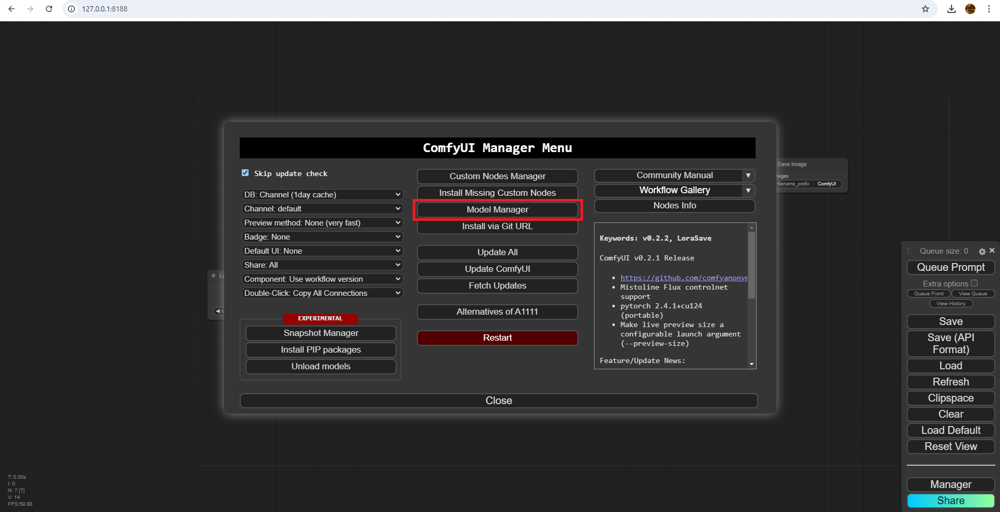
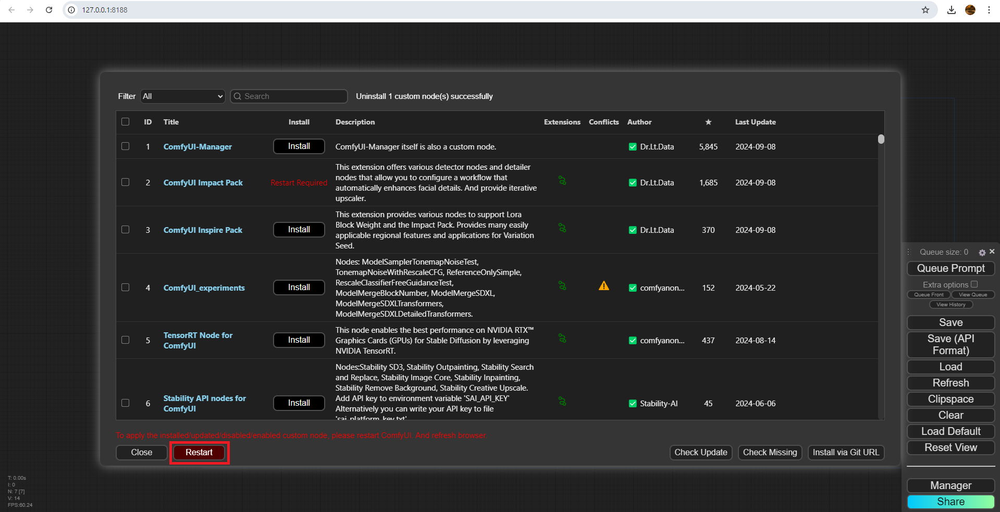
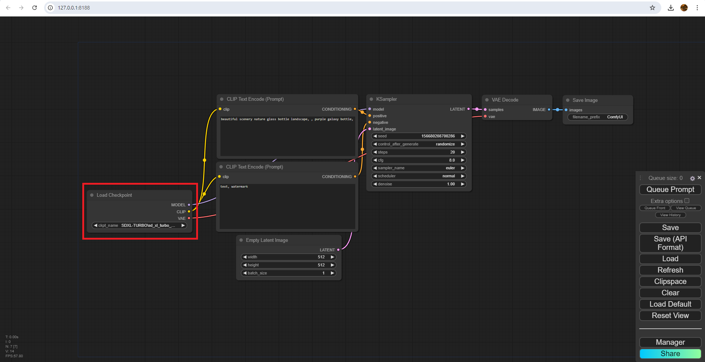
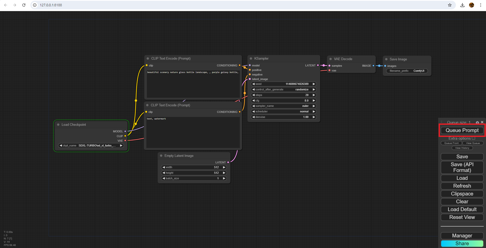
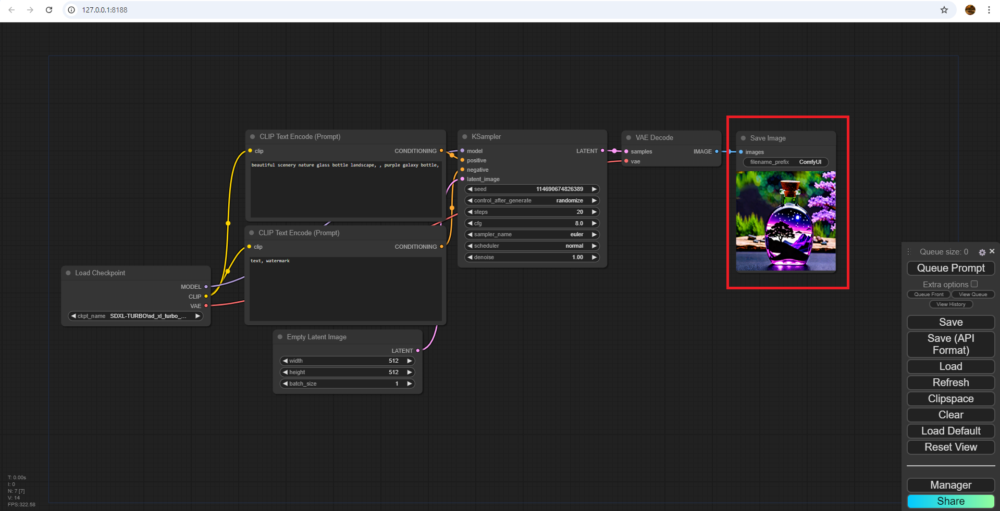

# Install Model
Finally, we need to install a `model`. The `Load Checkpoint` node can be interpreted as the loading the "AI model" used for image generation. Various `models` are available online for download, each differing in speed and quality based on the data used during their training. Choosing the right `model` is crucial, as it directly impacts the art style and performance of your project.

1. A common `model` used is `sd-xl 1.0`. We can try using this `model` for now. Inside ComfyUI, open up the ComfyUIManager by clicking on the `Manager` button located at the bottom of the sidebar. Refer to [ComfyUIManager](install-comfy-ui-manager.md) if you don't see it.

    

1. Click on the `Model Manager` button and search for `SDXL` in the search bar. Install `SDXL-Turbo 1.0`.

    

1. After the installation is done, you'll see that ComfyUIManager prompts you to restart ComfyUI to see the changes. Press the `restart` button to restart ComfyUI. (I used ComfyUI Impact Pack as an example. You don't have to download it on your end.)

    

1. After the server restarts, assign the `SDXL-Turbo 1.0` checkpoint in the `Load Checkpoint` node.

    

1. Then click on the `Queue Prompt` button at the top of the sidebar. You can tell which node ComfyUI is currently on by looking for the green outline on the nodes. You can also check the Command Prompt for more details.

    

1. After the generation is done, you can see the image result displayed under the `Save Image` node. Congratulations! You've used ComfyUI to generate your first ever AI art! You're now the #1 enemy for all artists!

    