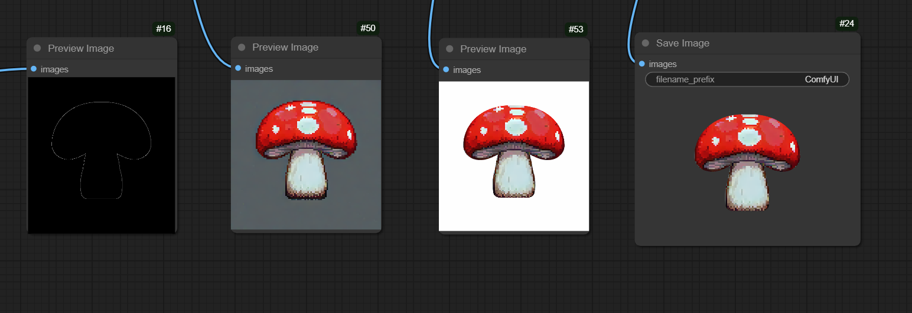

# Others
There are many custom nodes the community have developed. You're able to access and download them into ComfyUI using the `ComfyUI Manager`.

## Tiling
1. The first custom node we'll look at is the `Seamless Tiling Node` made by `spinagon`. To add it into ComfyUI, open up `ComfyUI Manager` and access the `Custom Nodes Manager` menu. You can then search for `Seamless Tiling Node` and `Install` it. Make sure to `restart` ComfyUI after the install is done to save the changes!

1. After ComfyUI restarts, you can search and add the `Seamless Tile` node into your workflow. As of the time of writing this, the node has 2 modifiable vairables:
    1. `tiling` 
    1. `copy_model`
1. Make sure `copy_model` is set to `Modify In Place` and you can play around with the different setting options for `tiling`. 

1. The node has a `model` input and a `MODEL` output. I'll leave it to you to connect this node into your workflow.

## Background Removal
1. Another awesome node made by the community is the `BRIA_RMBG` node made by `ZHO-ZHO-ZHO`. One of the bigges issues with ComfyUI is its inability to generate images with transparent background. `BRIA_RMBG` fixes this problem!

1. Installing `BRIA_RMBG` into ComfyUI is exactly the same as `Seamless Tile` mentioned above. The node takes in an `rmbgmodel` and the `image` you want to remove the background of. The `BRIA_RMBG Model Loader` node provides the model to the `BRIA_RMBG` node, so add it in and link the 2 nodes together.

1. Depending on your output, the background removal might vary. To further improve the `BRIA_RMBG` node's result, we can use...

## Masking
1. The `Masquerade Nodes` made by `BadCafeCode` provides the `Mix Color By Mask` nodamee. The steps to install it are exactly the same as the other 2 mentioned above.

1. With this use of the `Mix Color By Mask`, you can convert the backgroun of the generated image to completely white, which SIGNIFICANTLY helps the accuracy of the `BRIA_RMBG` node. However, you'll have to provide a mask to determine the area to color white.

1. I wont be providing the workflow for this, so please experiment with it.

1. You can use this in conjuncture with `controlnet` to supply the mask. As you can see, with the help of `Mix Color By Mask` node the `BRIA_RMBG` background removal is perfect.

1. I wont be providing the workflow for this, so please experiment with it. 

    