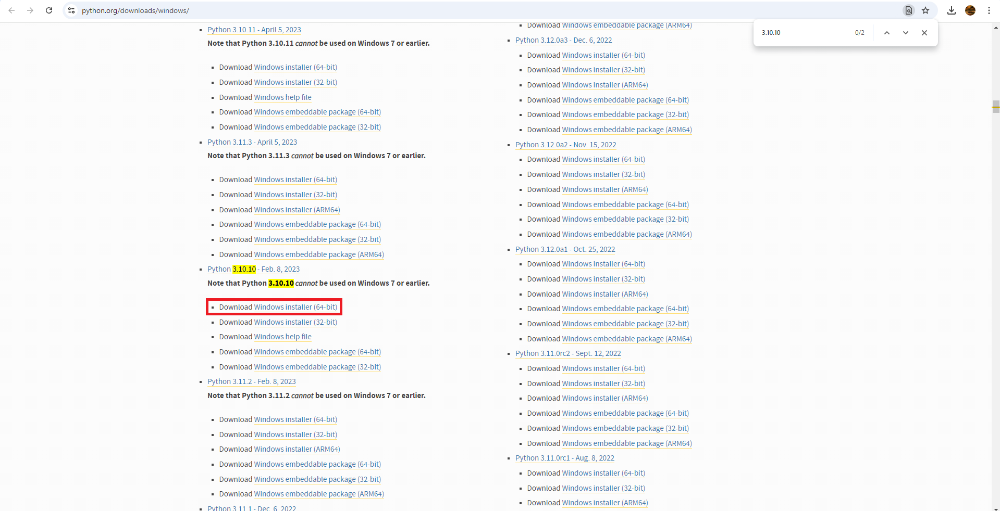

# Install Python
ComfyUI requires Python for its features. Don't worry, this will not affect anything on the Unity side! 

We'll be using Python 3.10.10 for Windows. Please make sure your Windows machine is higher than Windows 7, or it won't work!

1. Install Python [here](https://www.python.org/downloads/windows/)

1. To search for Python 3.10.10 with ease, hold `CTRL` + `H` and search for "3.10.10" in the search bar

    

1. After downloading the installer, double click it to launch the exe.

    

1. Make sure "Add Python to environment vairables" is checked in advanced options!

    

1. If you already have Python installed on your computer, just click on "Modify" and ensure "Add Python to environment vairables" is checked

    